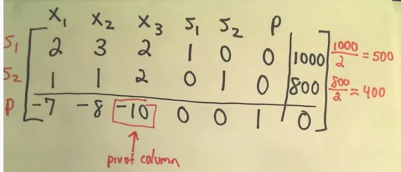
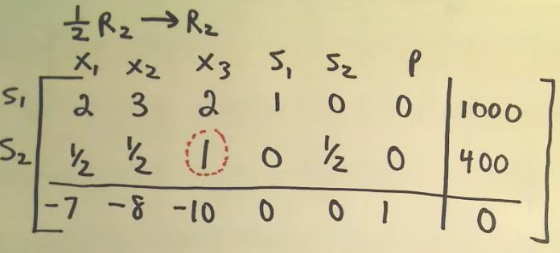
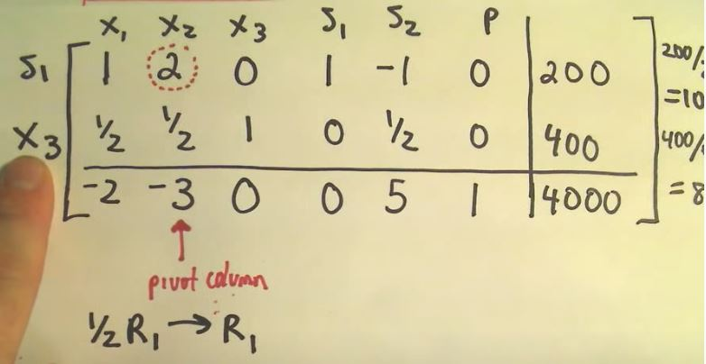

# Simplex Algorithm
## Convert the problem to the required form
1. maximazation problem
2. non-negative constraints
3. add slack variables to chnange the inequalities into equalities

> 1. after the preparation, we have several equations, with slack variables inside
> 2. we also know that we need maximize one paramter in the set of equations
> 3. from our intuitive, we know that as we increase the objective, all the other variables will change accordingly

we have a polygon in space. if there were some intersections, then the solution would be on this
> note that we don't have inequality here, so that the inner space would not be feasible

## Handle the tableau

1. Find the most negative coefficient
> P is positive, so find the variable with the most negative
>> it tells that the variable has the greatest impacts on the P, the objective
>> if the variable increased, the variable would increaese as well, with largest magnitude

2. Find the pivot and make the coefficient one by the row op
> the pivot column is choosen by previous step, because we knew that the variable has the greatest impacts on the objective  
> then we checked the constraints
>> here we see would find the least impacted constraint that the variable in
>> or we can say that row operation, numbers in the low column will still be non-negative

3. Do the row OP

> after the op, the x3 becomes the new slack variable replacing the s2, because now x3 only appears in one constraint, just as s2 was

## The core of simplex algorithm
1. find the most negative one in the last row, the we have the pivot column, then we can do something to the most influencial variable  
2. Do the row operation, so that the variable with most impacts would not affect the last row anymore
> the variable becomes new slack variable, it only affects one constraint  
> we eliminate the affects of the variable, meanwhile we introduce something new to the last row, but the introduced one is easy to handle

3. repeat the above process until no negative in the last row
4. now we have variables with positive coefficients and objective in the last row, then set the others to zero, we will have the max objective

5. what we ultimately wanna do is to set all coefficients in the last row positive, with the non-negative constraints, the maximization will be easy
