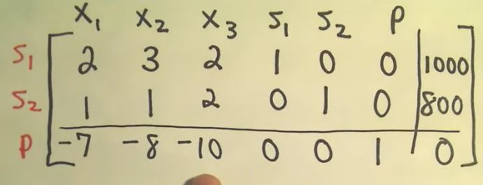

# Simplex Algorithm
## Convert the problem to the required form
1. maximazation problem
2. non-negative constraints
3. add slack variables to chnange the inequalities into equalities

> 1. after the preparation, we have several equations, with slack variables inside
> 2. we also know that we need maximize one paramter in the set of equations
> 3. from our intuitive, we know that as we increase the objective, all the other variables will change accordingly

we have a polygon in space. if there were some intersections, then the solution would be on this
> note that we don't have inequality here, so that the inner space would not be feasible

## Handle the tableau

1. Find the most negative coefficient
> P is positive, so find the variable with the most negative
>> it tells that the variable has the greatest impacts on the P, the objective

